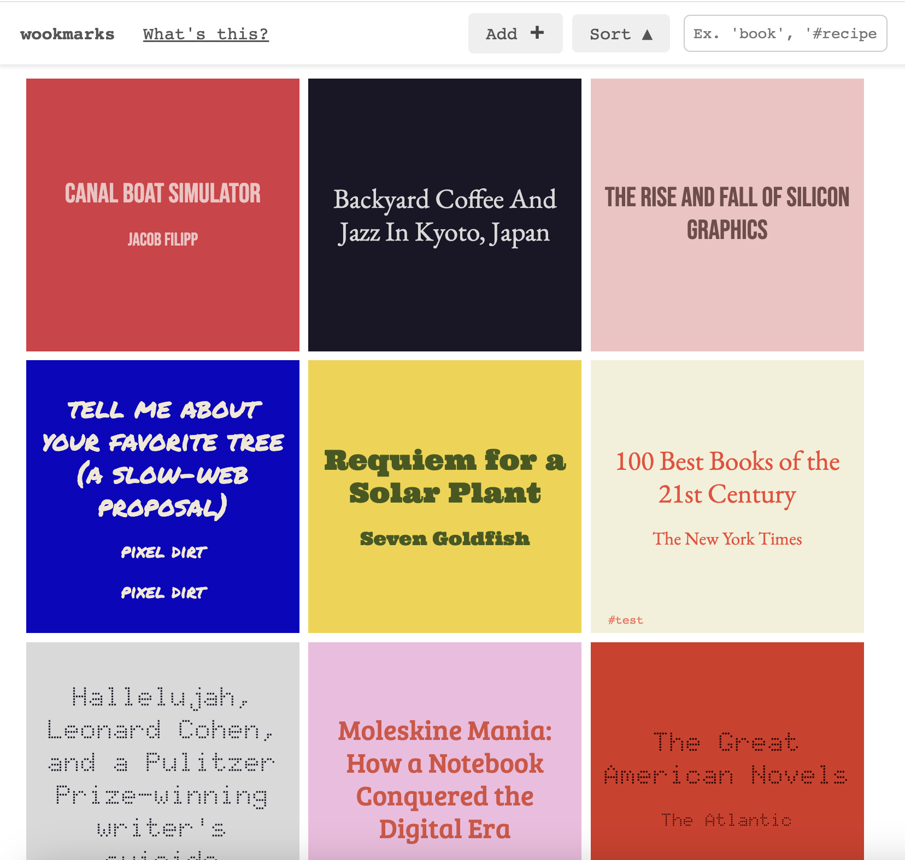
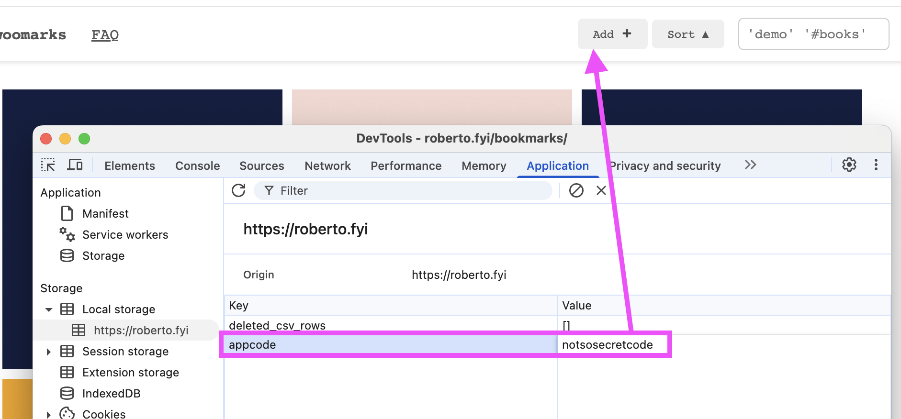

 

# woomarks
woomarks is an app that let's you save links in your browser storage, no account needed. 



It's only frontend code, no database, backend server needed.


It also can import/export to csv files or local storage.


## Demos
#### [Creator's personal boomarks page](https://roberto.fyi/bookmarks/).
- Saving is closed to the public.
- Saved links are visible to the public, as they are loaded from a csv file in the server.

#### [woomarks public app](https://woomarks.com). 
- Saving is open to the public.
- The saved links are private and saved in the browser local storage of the users.

 ## Install

#### BASIC INSTALL
 - Copy the contents of this repository to an online directory. That's all. You can start saving links.

#### SHOWCASE YOUR LINKS
- If you want to showcase your saved links, update the **mybookmarks.csv** file

#### IMPORT FROM POCKET
- Go to this Pocket page to export your links. https://getpocket.com/export.php?

**Option 1** (If you want your links public)
- Replace the mybookmarks.csv witha the content of your Pocket csv file.

**Option 2** (If you want your links saved on your browser's local storage)
- Add > Bulk Transfer > Paste the contents.

#### CREATE BOOKMARKLET
To be able to easily save bookmarks create a bookmarklet:
- In your browser, create a new bookmark with "add woomark" () as Name
- Paste the next code as URL.
```
javascript:(function(){
const url = encodeURIComponent(window.location.href);
const title = encodeURIComponent(document.title);
window.open(`https://YOURDOMAINGOESHERE.com/?title=${title}&url=${url}`, '_blank');
})();
```

#### HIDE SAVE BUTTON
 - If you are using this for your personal use (you don't want anyone else saving on your page), you can uncomment this line in **script.js** file
 and add the code you want here AND as a variable in your browser's local storage.

`
 // const appcode = "notsosecretcode"; 
 `

 

## Features
- Add/Delete links
- Search
- Tags
- Bookmarklet (useful for a 2-click-save)
- Data reads from: 
    - csv file in server (these links are public)
    - local storage in browser (these links are visible just for the user)
- Local storage saving.
- Import to local storage from csv file
- Export to csv from local storage.
- Export to csv from csv file (useful when links are "deleted" using the app and just hidden using a local storage blacklist).
- Export to csv from both places.
- No external libraries. 
- Vanilla css code.
- Vanilla js code.

## Design
 This design is inspired by Pocket's UI, which was very good for showing a list of articles to read later. Native bookmarking feels more utilitarian, suited for recurrent links, woomarks is more suited for read later links.

## Philosophy
I had all my bookmarks in Pocket and it's shutting down. Same thing happened to del.icio.us. So I decided to keep the web cool and decentralized and make this little thing. The code is open and you can use it on your own website forever.

## License
Do whatever you want with this, personal or commercial. No warranties are given.

Attribution required in a footer link, legible size and colour, with the text "Made with woomarks" and a link to `https://github.com/earlyriser/woomarks`. 
"Based on woomarks" is also a valid wording if substantial change was done.